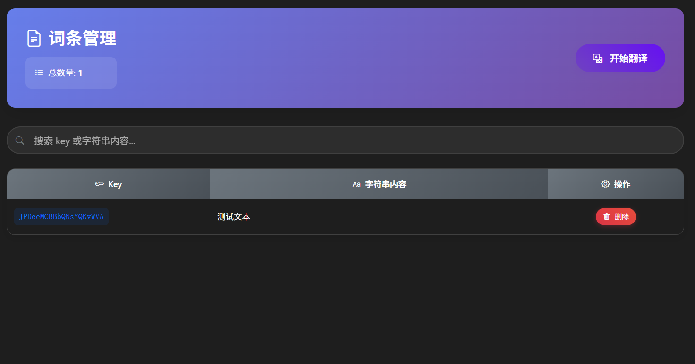
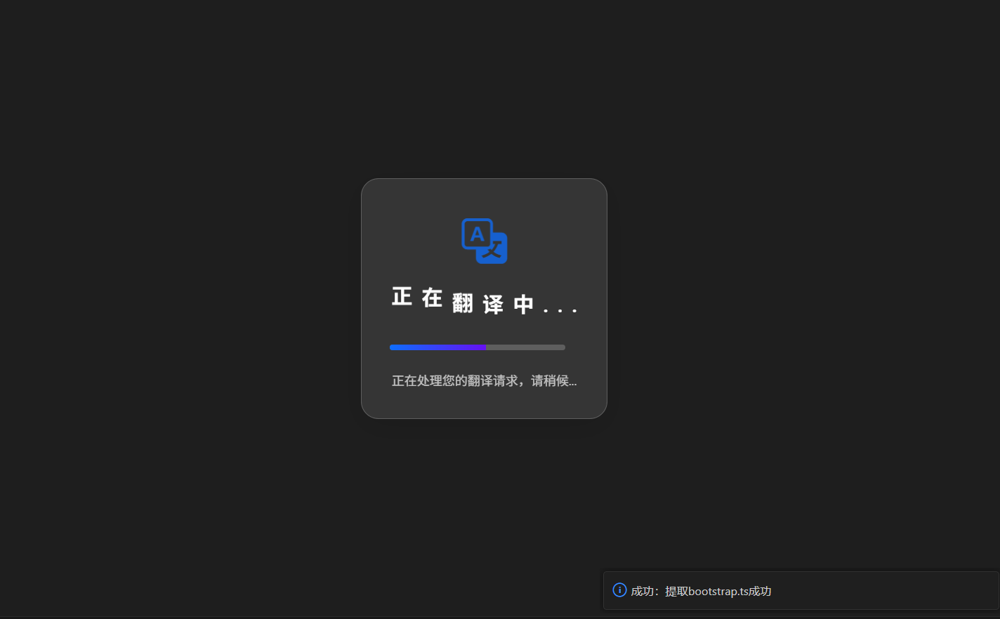
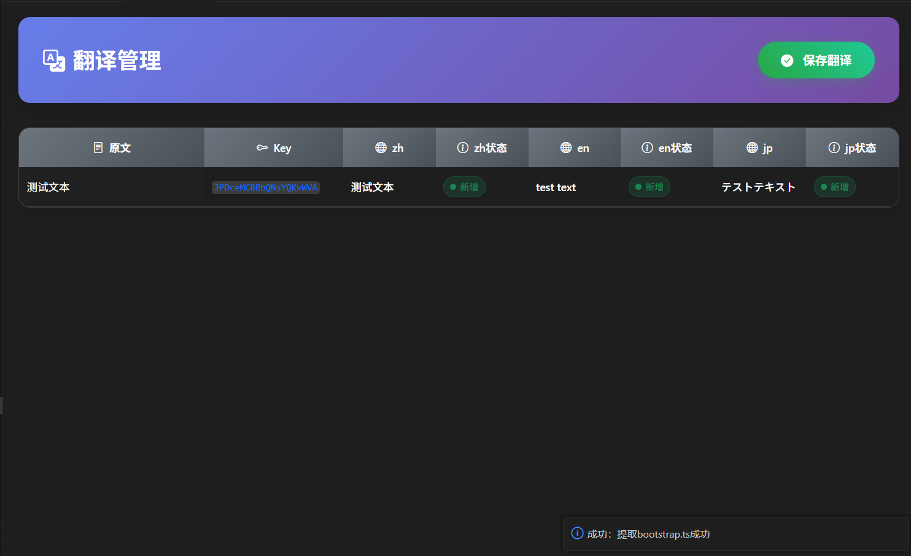

# Alad-i18n VSCode 插件

<a href="https://marketplace.visualstudio.com/items?itemName=rascal-coder1.Alad-i18n" target="__blank"></a>
[](LICENSE)
[](https://code.visualstudio.com/)

> 一个强大的 VSCode 国际化插件，支持自动提取代码中的中文文本，翻译成多种语言并生成国际化文件。

## ✨ 功能特性

- 🚀 **智能提取** - 自动识别并提取代码中的中文文本
- 🌍 **多语言支持** - 支持 20+ 种语言的翻译
- 📝 **自动生成** - 自动生成标准化的国际化文件
- ⚡ **Vue 3 支持** - 完美适配 Vue 3 项目的国际化需求
- 🔧 **灵活配置** - 丰富的配置选项，满足不同项目需求
- 🎯 **一键操作** - 快捷键和右键菜单，操作简单便捷

## 📝 使用示例

### 使用效果





## 🚀 快速开始

### 安装

1. 在 VSCode 中打开扩展面板 (`Ctrl+Shift+X`)
2. 搜索 "Alad-i18n"
3. 点击安装

### 基本使用

#### 快捷键

- **Windows/Linux**: `Ctrl+Shift+T`
- **Mac**: `Cmd+Shift+T`

#### 右键菜单

在支持的文件类型（JavaScript、TypeScript、Vue 等）中右键选择 **"Alad-i18n: 翻译当前页面"**

## ⚙️ 配置指南

### 必要配置

在使用插件前，必须配置百度翻译的 API 凭据：

1. 前往 [百度翻译开放平台](https://fanyi-api.baidu.com/) 申请账号
2. 创建应用获取 App ID 和密钥
3. 在项目的 `.vscode/settings.json` 中配置：

```json
{
  "Alad-i18n.Baidu App Id": "your_app_id",
  "Alad-i18n.Baidu App Token": "your_app_secret"
}
```

### 完整配置示例

```json
{
  "Alad-i18n.Baidu App Id": "your_baidu_app_id",
  "Alad-i18n.Baidu App Token": "your_baidu_app_token",
  "Alad-i18n.OutFile": "alad-i18n-out",
  "Alad-i18n.I18nLang": "/src/i18n/zh",
  "Alad-i18n.FileOutMode": "unified",
  "Alad-i18n.UnifiedFileName": "lang",
  "Alad-i18n.Vue3i18n": true,
  "Alad-i18n.LocalesMehodName": "$t",
  "Alad-i18n.OutExtractFile": false,
  "Alad-i18n.Languages": ["zh:zh-CN", "en:en-US"],
  "Alad-i18n.LocalesPath": "src/locales/langs",
  "Alad-i18n.ImportCode": "import { $t } from '@/locales';\n",
  "Alad-i18n.LocalesPerfix": "locale"
}
```

### 配置项详解

| 配置项                       | 类型       | 默认值                                | 说明                 | 必填 |
| ---------------------------- | ---------- | ------------------------------------- | -------------------- | ---- |
| `Alad-i18n.Baidu App Id`     | `string`   | `""`                                  | 百度翻译 App ID      | ✅   |
| `Alad-i18n.Baidu App Token`  | `string`   | `""`                                  | 百度翻译 App Token   | ✅   |
| `Alad-i18n.OutFile`          | `string`   | `"alad-i18n-out"`                     | 输出文件目录名称     | ❌   |
| `Alad-i18n.I18nLang`         | `string`   | `""`                                  | 项目的 i18n 语言路径 | ❌   |
| `Alad-i18n.FileOutMode`      | `string`   | `"unified"`                           | 文件输出模式         | ❌   |
| `Alad-i18n.UnifiedFileName`  | `string`   | `"lang"`                              | 统一输出的文件名称   | ❌   |
| `Alad-i18n.Vue3i18n`         | `boolean`  | `true`                                | 是否是 Vue 3 项目    | ❌   |
| `Alad-i18n.LocalesMehodName` | `string`   | `"$t"`                                | i18n 方法名          | ❌   |
| `Alad-i18n.OutExtractFile`   | `