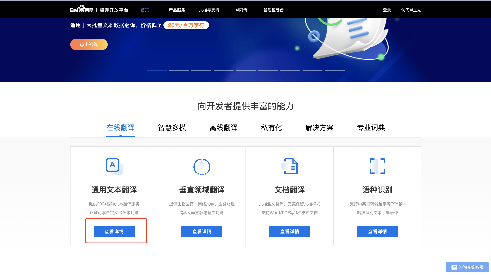
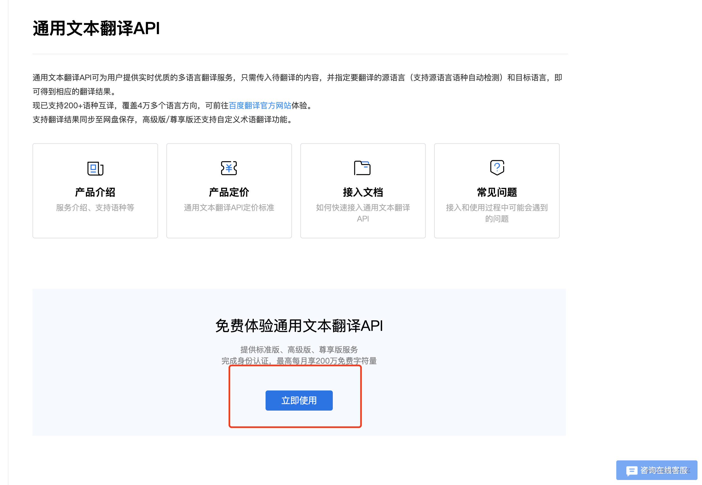
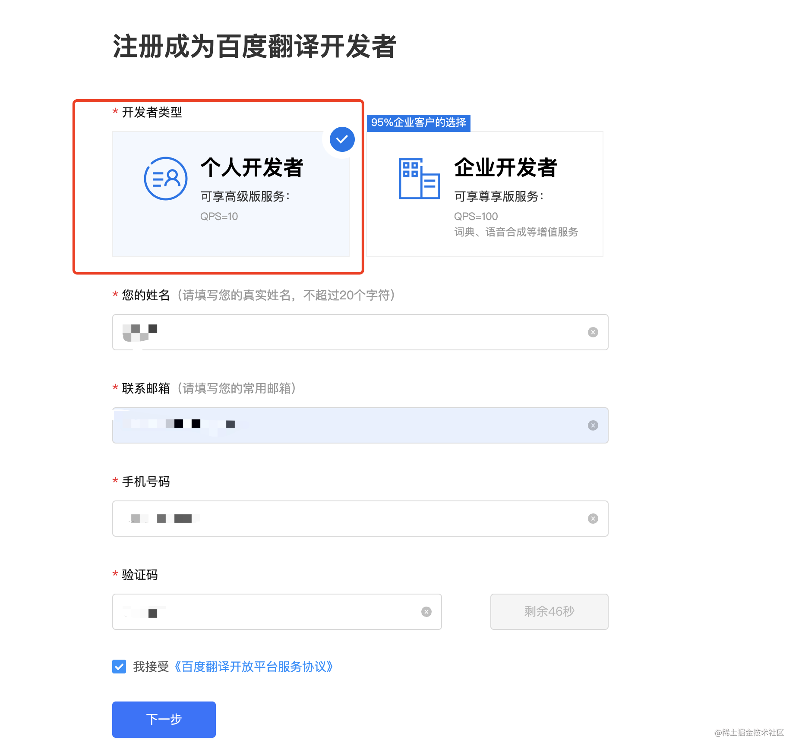
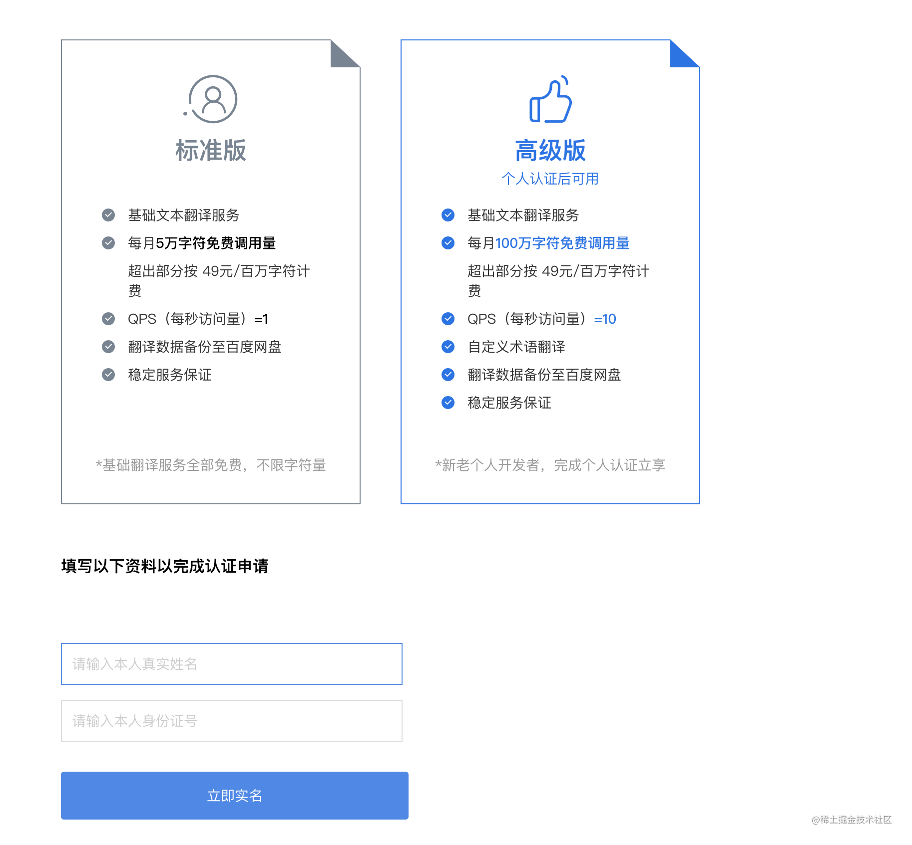
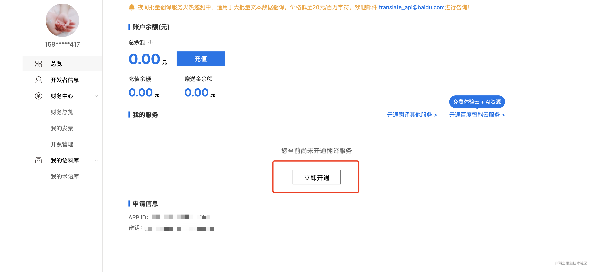
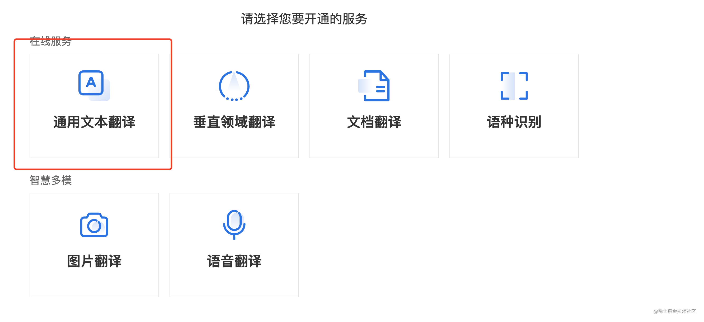
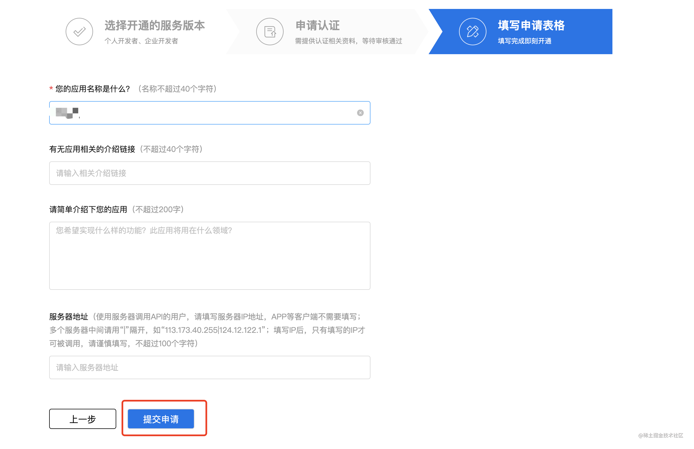

# Alad-i18n VSCode 插件

[](https://marketplace.visualstudio.com/items?itemName=alad-i18n)
[](LICENSE)
[](https://code.visualstudio.com/)

> 一个强大的 VSCode 国际化插件，支持自动提取代码中的中文文本，翻译成多种语言并生成国际化文件。

## ✨ 功能特性

- 🚀 **智能提取** - 自动识别并提取代码中的中文文本
- 🌍 **多语言支持** - 支持 20+ 种语言的翻译
- 📝 **自动生成** - 自动生成标准化的国际化文件
- ⚡ **Vue 3 支持** - 完美适配 Vue 3 项目的国际化需求
- 🔧 **灵活配置** - 丰富的配置选项，满足不同项目需求
- 🎯 **一键操作** - 快捷键和右键菜单，操作简单便捷

## 🚀 快速开始

### 安装

1. 在 VSCode 中打开扩展面板 (`Ctrl+Shift+X`)
2. 搜索 "Alad-i18n"
3. 点击安装

### 基本使用

#### 快捷键

- **Windows/Linux**: `Ctrl+Shift+T`
- **Mac**: `Cmd+Shift+T`

#### 右键菜单

在支持的文件类型（JavaScript、TypeScript、Vue 等）中右键选择 **"Alad-i18n: 翻译当前页面"**

## ⚙️ 配置指南

### 必要配置

在使用插件前，必须配置百度翻译的 API 凭据：

1. 前往 [百度翻译开放平台](https://fanyi-api.baidu.com/) 申请账号
2. 创建应用获取 App ID 和密钥
3. 在项目的 `.vscode/settings.json` 中配置：

```json
{
  "Alad-i18n.Baidu App Id": "your_app_id",
  "Alad-i18n.Baidu App Token": "your_app_secret"
}
```

### 完整配置示例

```json
{
  "Alad-i18n.Baidu App Id": "your_baidu_app_id",
  "Alad-i18n.Baidu App Token": "your_baidu_app_token",
  "Alad-i18n.OutFile": "alad-i18n-out",
  "Alad-i18n.I18nLang": "/src/i18n/zh",
  "Alad-i18n.FileOutMode": "unified",
  "Alad-i18n.UnifiedFileName": "lang",
  "Alad-i18n.Vue3i18n": true,
  "Alad-i18n.LocalesMehodName": "$t",
  "Alad-i18n.OutExtractFile": false,
  "Alad-i18n.Languages": ["zh:zh-CN", "en:en-US"],
  "Alad-i18n.LocalesPath": "src/locales/langs",
  "Alad-i18n.ImportCode": "import { $t } from '@/locales';\n",
  "Alad-i18n.LocalesPerfix": "locale"
}
```

### 配置项详解

| 配置项                       | 类型       | 默认值                                | 说明                 | 必填 |
| ---------------------------- | ---------- | ------------------------------------- | -------------------- | ---- |
| `Alad-i18n.Baidu App Id`     | `string`   | `""`                                  | 百度翻译 App ID      | ✅   |
| `Alad-i18n.Baidu App Token`  | `string`   | `""`                                  | 百度翻译 App Token   | ✅   |
| `Alad-i18n.OutFile`          | `string`   | `"alad-i18n-out"`                     | 输出文件目录名称     | ❌   |
| `Alad-i18n.I18nLang`         | `string`   | `""`                                  | 项目的 i18n 语言路径 | ❌   |
| `Alad-i18n.FileOutMode`      | `string`   | `"unified"`                           | 文件输出模式         | ❌   |
| `Alad-i18n.UnifiedFileName`  | `string`   | `"lang"`                              | 统一输出的文件名称   | ❌   |
| `Alad-i18n.Vue3i18n`         | `boolean`  | `true`                                | 是否是 Vue 3 项目    | ❌   |
| `Alad-i18n.LocalesMehodName` | `string`   | `"$t"`                                | i18n 方法名          | ❌   |
| `Alad-i18n.OutExtractFile`   | `boolean`  | `false`                               | 是否输出提取的文件   | ❌   |
| `Alad-i18n.Languages`        | `string[]` | `["zh:zh-CN", "en:en-US"]`            | 支持的语言列表       | ❌   |
| `Alad-i18n.LocalesPath`      | `string`   | `""`                                  | 多语言文件输出路径   | ❌   |
| `Alad-i18n.ImportCode`       | `string`   | `"import { $t } from '#/locales';\n"` | 自动注入的导入代码   | ❌   |
| `Alad-i18n.LocalesPerfix`    | `string`   | `"locale"`                            | 多语言键值前缀       | ❌   |

### 配置说明

#### 文件输出模式

- **`unified`**: 统一模式，所有翻译结果合并到一个文件中
- **`file`**: 按文件模式，每个源文件对应一个翻译文件

#### 语言列表格式

语言列表使用 `"源语言:目标语言"` 的格式，例如：

- `"zh:zh-CN"`: 中文到简体中文
- `"en:en-US"`: 英文到美式英文

## 🌍 支持的语言

| 语言       | 代码  | 语言         | 代码  |
| ---------- | ----- | ------------ | ----- |
| 中文       | `zh`  | 英语         | `en`  |
| 粤语       | `yue` | 文言文       | `wyw` |
| 日语       | `jp`  | 韩语         | `kor` |
| 法语       | `fra` | 西班牙语     | `spa` |
| 泰语       | `th`  | 阿拉伯语     | `ara` |
| 俄语       | `ru`  | 葡萄牙语     | `pt`  |
| 德语       | `de`  | 意大利语     | `it`  |
| 希腊语     | `el`  | 荷兰语       | `nl`  |
| 波兰语     | `pl`  | 保加利亚语   | `bul` |
| 爱沙尼亚语 | `est` | 丹麦语       | `dan` |
| 芬兰语     | `fin` | 捷克语       | `cs`  |
| 罗马尼亚语 | `rom` | 斯洛文尼亚语 | `slo` |
| 瑞典语     | `swe` | 匈牙利语     | `hu`  |
| 繁体中文   | `cht` | 越南语       | `vie` |

## 🔧 百度翻译 API 配置指南

### 开通步骤

1. **注册账号**
   - 访问 [百度翻译开放平台](https://fanyi-api.baidu.com)
   - 使用百度账号登录

2. **选择服务**
   - 点击"通用文本翻译"的"查看详情"
     
   - 点击"立即使用"
     

3. **填写信息**
   - 选择"个人开发者"
   - 填写基本信息
     
   - 完成实名认证（可选，用于开通高级版）
     

4. **开通服务**
   - 点击立即开通
     
   - 选择"通用文本翻译"
     
   - 选择"高级版"
     
   - 填写应用名称
     
   - 提交申请（通常秒通过）

### 获取凭据

开通成功后，在控制台可以获取：

- **App ID**: 应用标识
- **App Token**: 应用密钥
  

> ⚠️ **重要提醒**: 百度翻译每月提供 100 万字符的免费额度，超出部分会收费。请妥善保管您的 API 凭据。

## 🛠️ 开发指南

### 环境要求

- Node.js >= 14
- VSCode >= 1.60

### 本地开发

```bash
# 克隆项目
git clone https://github.com/Rascal-Coder/alad-i18n.git
cd alad-i18n

# 安装依赖
npm install

# 编译项目
npm run build

# 打包插件
npm run package
```

### 发布

1. 安装打包工具：
   ```bash
   npm install -g @vscode/vsce
   ```

2. 构建插件：
   ```bash
   npm run build
   ```

3. 生成 `.vsix` 文件：
   ```bash
   vsce package
   ```

4. 安装到本地 VSCode：
   - 打开 VSCode
   - 按 `Ctrl+Shift+P` 打开命令面板
   - 输入 "Extensions: Install from VSIX"
   - 选择生成的 `.vsix` 文件

## 📝 更新日志

详见 [CHANGELOG.md](CHANGELOG.md)

## 📄 许可证

本项目遵循 [MIT 许可证](LICENSE)。

## 🙏 致谢

感谢 [百度翻译开放平台](https://fanyi-api.baidu.com/) 提供的翻译服务支持。
参考[easy-i18n-helper](https://github.com/dbfu/easy-i18n-helper/tree/main)

---

如果这个插件对您有帮助，请给我们一个 ⭐️ Star！
